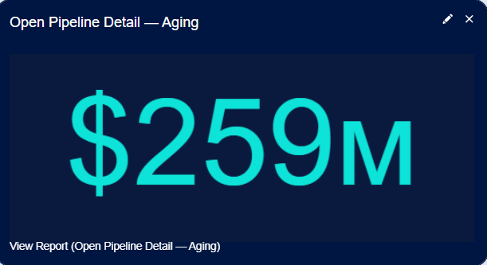
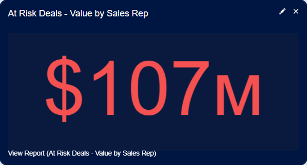
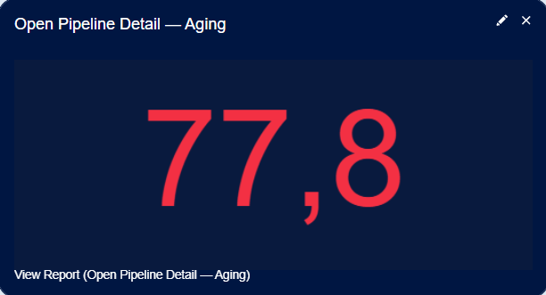
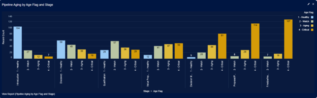
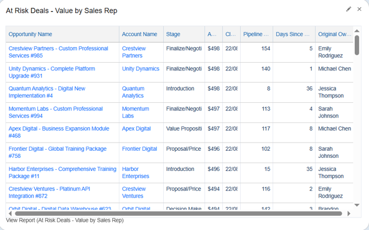
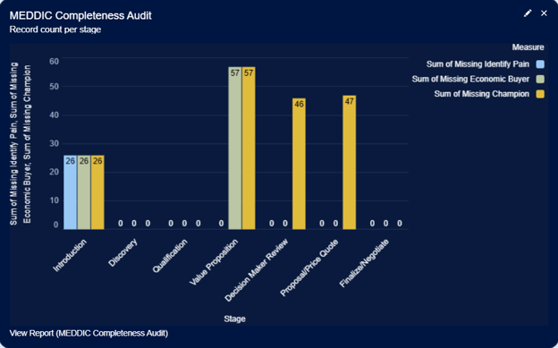

# Pipeline Aging & Health Monitor Dashboard Narrative

> **Author:** Alexander Marvin  
> **Date:** May 2026  
> **Tool:** Salesforce Lightning (Developer Edition)  
> **Data:** Opportunity pipeline, opportunity age, deal risk indicators, sales stage progression, MEDDIC qualification data, and revenue forecasting metrics (sample data)  
> **Purpose:** Demonstrate pipeline health visibility, aging analysis, deal risk identification, qualification completeness auditing, and revenue operations oversight through a unified pipeline monitoring framework.

---

## Executive Summary

This dashboard serves as a pipeline health management center, providing leadership and revenue operations teams with complete visibility into pipeline aging, deal risk, qualification quality, and overall opportunity health. By combining pipeline value metrics, aging analysis, at-risk opportunity monitoring, and MEDDIC qualification auditing, the dashboard enables sales organizations to proactively identify stalled opportunities, reduce pipeline risk, improve forecast reliability, and strengthen deal execution discipline. Decision-makers can quickly determine where pipeline value is concentrated, which opportunities require immediate attention, and whether qualification standards are being consistently maintained throughout the sales process.

---

## 🔑 Strategic Insights Summary

1. Complete pipeline visibility provides a unified view of revenue opportunity health

**Business Impact:** Leadership can monitor total active pipeline value, assess coverage against revenue targets, and understand overall pipeline quality from a single source of truth  
**Recommended Action:** Regularly compare open pipeline value against revenue objectives and incorporate pipeline health indicators into forecasting reviews

2. At-risk pipeline reporting enables proactive revenue protection

**Business Impact:** Sales managers can quantify potential revenue exposure, identify high-risk opportunities, and focus intervention efforts where they will have the greatest impact on forecast attainment  
**Recommended Action:** Establish recurring deal review sessions for high-value at-risk opportunities and implement recovery plans for stalled deals

3. Pipeline age and aging analysis reveal bottlenecks before they impact revenue performance

**Business Impact:** Revenue teams can identify slowing sales cycles, stalled opportunities, and stage-specific bottlenecks that reduce pipeline efficiency and forecast reliability  
**Recommended Action:** Monitor aging trends regularly and investigate stages where opportunities accumulate beyond expected sales cycle benchmarks

4. Health segmentation improves prioritization and operational focus

**Business Impact:** Color-coded classifications such as Healthy, Watch, Aging, and Critical allow teams to quickly identify which opportunities require immediate attention and resource allocation  
**Recommended Action:** Develop standardized action plans for each health category and ensure managers actively monitor movement between classifications

5. MEDDIC qualification auditing strengthens pipeline quality and forecast confidence

**Business Impact:** Organizations can validate that opportunities are progressing with sufficient qualification rigor while identifying stages where qualification standards are inconsistently applied  
**Recommended Action:** Require remediation of incomplete MEDDIC criteria before advancing opportunities and provide targeted coaching where qualification compliance is weak

6. A shared pipeline health framework improves cross-functional alignment

**Business Impact:** Sales leadership, revenue operations, and frontline managers gain a common understanding of pipeline quality, risk exposure, qualification effectiveness, and forecast accuracy  
**Recommended Action:** Use dashboard metrics as the standard foundation for pipeline reviews, forecast discussions, coaching sessions, and revenue planning activities

---

## 📊 Dashboard Walkthrough

### ROW 1: Pipeline Health KPIs

#### Total Open Pipeline (Metric)

| KPI | Value |
|------|------|
| Total Open Pipeline | Sum of Amount |

**Key Takeaway:**  
Provides visibility into the total value of all open opportunities currently in the sales pipeline. This metric serves as a high-level indicator of potential future revenue and overall pipeline coverage.

**Recommended Action:**
- Monitor total pipeline value against revenue targets.
- Track changes in pipeline size over time.
- Investigate significant increases or decreases in open opportunity value.

---

#### At Risk Pipeline (Metric)

| KPI | Value |
|------|------|
| At Risk Pipeline Value | Sum of Amount |

**Key Takeaway:**  
Measures the total value of opportunities identified as being at risk due to age, inactivity, qualification gaps, or other health indicators.

**Recommended Action:**
- Prioritize review of high-value at-risk opportunities.
- Escalate stalled deals requiring management attention.
- Track risk exposure as part of forecast reviews.

---

#### Avg Pipeline Age (Metric)

| KPI | Value |
|------|------|
| Avg Pipeline Age | Average Pipeline Age Days |

**Key Takeaway:**  
Displays the average age of active opportunities within the pipeline, helping teams identify whether deals are progressing within expected sales cycle timelines.

**Recommended Action:**
- Monitor age trends for signs of slowing deal progression.
- Compare average age against expected sales cycle benchmarks.
- Investigate opportunities contributing to elevated pipeline age.

---

### ROW 2: Pipeline Aging Analysis

#### Pipeline Aging by Age Flag (Stacked Bar)

| Visualization | Value |
|------|------|
| Aging Breakdown | Opportunity Distribution by Age Flag and Stage |

**Key Takeaway:**  
Provides a visual breakdown of pipeline health across stages using age-based classifications such as Healthy, Watch, Aging, and Critical.

**Recommended Action:**
- Identify stages accumulating aging opportunities.
- Monitor movement between health categories over time.
- Address process bottlenecks contributing to prolonged opportunity age.

---

### ROW 3: Risk & Qualification Management

#### At Risk Deals Table

| Visualization | Value |
|------|------|
| At Risk Deals | Top Opportunities by Amount |

**Key Takeaway:**  
Highlights the highest-value at-risk opportunities, allowing managers to focus attention on deals with the greatest potential forecast impact.

**Recommended Action:**
- Conduct targeted reviews of listed opportunities.
- Develop recovery plans for stalled deals.
- Monitor progress and risk status during pipeline inspections.

---

#### MEDDIC Completeness Audit (Bar Chart)

| Visualization | Value |
|------|------|
| MEDDIC Audit | Qualification Completeness by Stage |

**Key Takeaway:**  
Evaluates qualification completeness across sales stages, providing visibility into adherence to MEDDIC methodology and overall opportunity quality.

**Recommended Action:**
- Identify stages with lower qualification completeness.
- Reinforce qualification standards through coaching and enablement.
- Require remediation of missing MEDDIC elements before advancing opportunities.

---
