# Revenue Forecast & Rep Performance Hub Dashboard Narrative

> **Author:** Alexander Marvin  
> **Date:** May 2026  
> **Tool:** Salesforce Lightning (Developer Edition)  
> **Data:** Opportunity pipeline, forecast categories, stage progression, weighted revenue projections, and sales rep performance metrics (sample data)  
> **Purpose:** Demonstrate executive-level forecast visibility, pipeline composition analysis, stage distribution insights, and sales rep performance tracking through a unified forecasting and revenue operations dashboard.

---

## Executive Summary

This dashboard serves as an executive forecasting command center, providing leadership and revenue operations teams with a consolidated view of revenue performance across forecast categories, pipeline stages, and individual sales representatives. By combining non-weighted and weighted forecasting models with stage-level pipeline distribution and rep performance tracking, the dashboard enables accurate revenue forecasting, improved pipeline accountability, and clearer visibility into quota attainment dynamics. Decision-makers can quickly assess total pipeline health, evaluate forecast reliability, identify concentration risks across stages or reps, and understand whether the organization is on track to meet revenue targets.

---

## 🔑 Strategic Insights Summary

1. Dual forecast modeling improves revenue prediction accuracy

**Business Impact:** Combining non-weighted and weighted forecast views allows leadership to compare raw pipeline value against probability-adjusted revenue expectations, improving forecast reliability and reducing optimism bias.  

**Recommended Action:** Use weighted forecast metrics during executive forecasting sessions while referencing non-weighted views for pipeline generation and deal sourcing analysis.

---

2. Forecast category distribution reveals revenue progression health

**Business Impact:** Visibility across Pipeline, Best Case, Commit, and Closed categories helps identify whether opportunities are effectively advancing through the revenue lifecycle or stagnating in early stages.  

**Recommended Action:** Monitor shifts between forecast categories and enforce pipeline progression discipline through structured deal reviews.

---

3. Stage-level pipeline analysis identifies structural bottlenecks

**Business Impact:** Breaking pipeline value across sales stages highlights where revenue is accumulating, revealing inefficiencies in conversion rates or stage progression velocity.  

**Recommended Action:** Investigate stages with abnormal concentration and implement targeted enablement or process improvements.

---

4. Rep-level performance tracking enables quota and capacity visibility

**Business Impact:** Stacked views of pipeline value by sales rep and stage provide insight into workload distribution, revenue ownership, and execution consistency across the sales team.  

**Recommended Action:** Balance pipeline coverage across reps and use performance insights to guide coaching and territory adjustments.

---

5. Weighted rep performance improves forecast accountability

**Business Impact:** Expected revenue views by rep provide a more realistic assessment of quota attainment probability, reducing reliance on inflated pipeline figures.  

**Recommended Action:** Use weighted performance metrics in forecast calls to evaluate true rep-level contribution toward revenue targets.

---

6. Executive dashboard consolidation improves decision-making speed

**Business Impact:** A unified view of funnel metrics, stage distribution, and rep performance reduces the need for multiple reports, enabling faster and more accurate revenue decisions.  

**Recommended Action:** Standardize this dashboard as the primary input for forecast reviews, pipeline inspections, and executive revenue planning sessions.

---

## 📊 Dashboard Walkthrough

### ROW 1: Forecast Funnel Overview (Non-Weighted vs Weighted)

#### Pipeline Forecast Funnel (Funnel Chart)

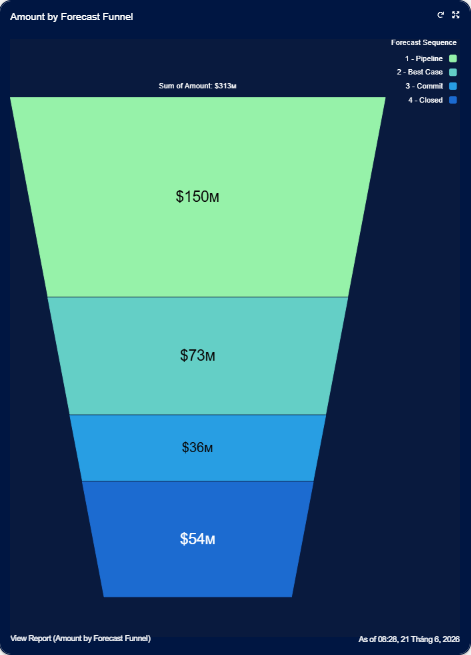

| Chart | Value |
|------|------|
| Pipeline Forecast Funnel | Sum of Amount by Forecast Category |

**Key Takeaway:**  
Provides a top-level view of forecasted revenue by displaying the distribution of opportunity value across Pipeline, Best Case, Commit, and Closed forecast categories. This view helps leadership understand how revenue is expected to progress through the forecasting hierarchy.

**Recommended Action:**
- Monitor the balance between Pipeline, Best Case, Commit, and Closed opportunity value.
- Evaluate whether sufficient opportunity volume is progressing toward Commit status.
- Use changes in funnel composition to assess forecast confidence.

---

#### Pipeline Forecast Funnel (Weighted) (Funnel Chart)

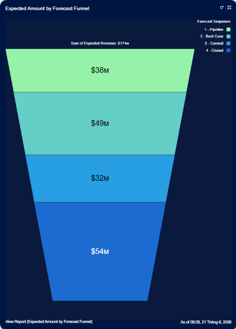

| Chart | Value |
|------|------|
| Pipeline Forecast Funnel (Weighted) | Sum of Expected Revenue by Forecast Category |

**Key Takeaway:**  
Applies probability weighting to forecast categories, providing a more realistic estimate of expected revenue outcomes and improving forecast accuracy.

**Recommended Action:**
- Compare weighted and non-weighted funnel distributions regularly.
- Investigate large gaps between raw opportunity value and expected revenue.
- Use weighted forecasts during executive forecasting discussions.

---

### ROW 2: Total Pipeline Value Summary

#### Total Pipeline Value (Metric)

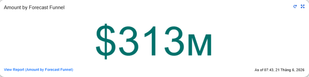

| KPI | Value |
|------|------|
| Total Pipeline Value | Sum of Amount |

**Key Takeaway:**  
Represents the aggregate value of all forecast categories combined using raw opportunity values, providing a high-level measure of overall revenue potential.

**Recommended Action:**
- Monitor overall pipeline growth over time.
- Compare pipeline value against revenue targets and quota requirements.
- Investigate significant changes in total forecast value.

---

#### Total Pipeline Value (Weighted) (Metric)

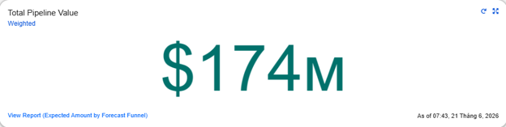

| KPI | Value |
|------|------|
| Total Pipeline Value (Weighted) | Sum of Expected Revenue |

**Key Takeaway:**  
Measures the probability-adjusted value of the entire forecast, providing a more realistic estimate of potential revenue realization.

**Recommended Action:**
- Track expected revenue trends throughout the quarter.
- Compare weighted forecast value against historical conversion performance.
- Use weighted pipeline metrics during forecast reviews and planning discussions.

---

### ROW 3: Forecast Composition (Donut Analytics)

#### Active Deal Value (Donut Chart)

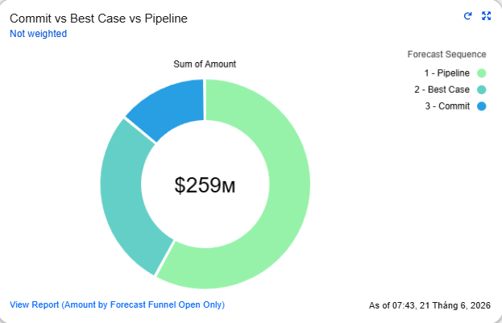

| Chart | Value |
|------|------|
| Active Deal Value | Sum of Amount by Forecast Category |

**Key Takeaway:**  
Breaks down active opportunity value across Pipeline, Best Case, and Commit categories, helping identify where open forecast value is concentrated.

**Recommended Action:**
- Monitor shifts between Pipeline, Best Case, and Commit categories.
- Ensure sufficient opportunity value progresses toward later forecast stages.
- Use composition trends to assess forecast maturity.

---

#### Closed Deal Value (Donut Chart)

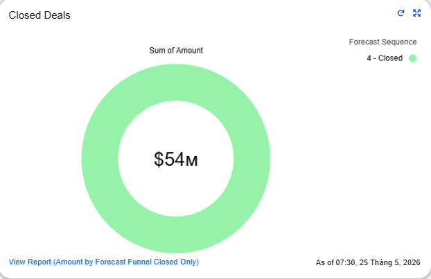

| Chart | Value |
|------|------|
| Closed Deal Value | Sum of Amount |

**Key Takeaway:**  
Displays revenue that has already been successfully closed, providing visibility into confirmed revenue contribution and forecast achievement.

**Recommended Action:**
- Compare closed revenue against targets and commitments.
- Monitor closed revenue growth throughout the quarter.
- Use closed revenue as a benchmark for forecast accuracy.

---

#### Active Deal Value (Weighted) (Donut Chart)

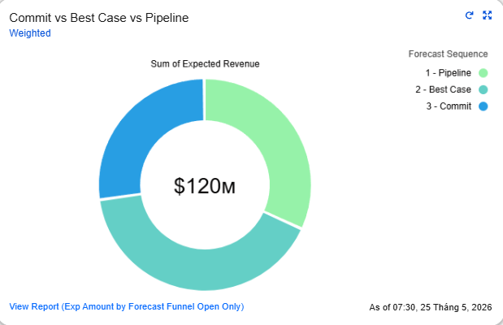

| Chart | Value |
|------|------|
| Active Deal Value (Weighted) | Sum of Expected Revenue by Forecast Category |

**Key Takeaway:**  
Provides a probability-adjusted view of active opportunity value, helping leadership understand where expected revenue is most likely to originate.

**Recommended Action:**
- Compare weighted and non-weighted active deal composition.
- Monitor changes in expected revenue distribution across forecast categories.
- Use weighted composition analysis to improve forecast reliability.

---

### ROW 4: Pipeline Value by Stage (Non-Weighted vs Weighted)

#### Pipeline Value by Stage (Horizontal Bar Chart)

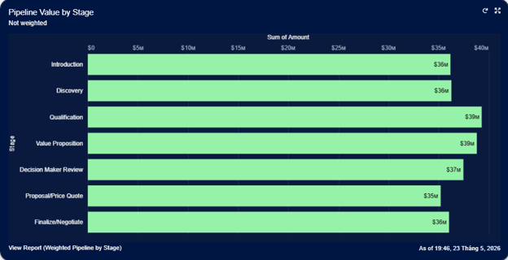

| Chart | Value |
|------|------|
| Pipeline Value by Stage | Sum of Amount by Stage |

**Key Takeaway:**  
Shows how opportunity value is distributed throughout the sales process, highlighting where pipeline concentration exists and identifying potential stage bottlenecks.

**Recommended Action:**
- Monitor stage distribution for signs of pipeline stagnation.
- Investigate stages with unusually large accumulations of opportunity value.
- Use stage analysis to improve pipeline flow and conversion rates.

---

#### Pipeline Value by Stage (Weighted) (Horizontal Bar Chart)

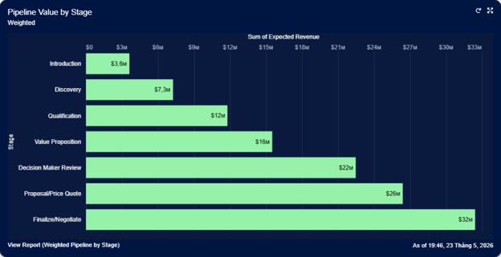

| Chart | Value |
|------|------|
| Pipeline Value by Stage (Weighted) | Sum of Expected Revenue by Stage |

**Key Takeaway:**  
Displays expected revenue contribution by sales stage, providing insight into where forecasted revenue is most likely to be generated.

**Recommended Action:**
- Evaluate whether sufficient weighted revenue exists in late-stage opportunities.
- Monitor stage progression and conversion effectiveness.
- Use weighted stage analysis during forecasting reviews.

---

### ROW 5: Rep Performance (Stacked by Stage)

#### Value by Rep (Stacked Vertical Bar Chart)

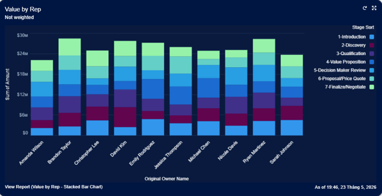

| Chart | Value |
|------|------|
| Value by Rep | Sum of Amount by Owner and Stage |

**Key Takeaway:**  
Provides visibility into how total opportunity value is distributed across sales representatives and sales stages, helping assess workload and pipeline ownership.

**Recommended Action:**
- Identify reps with insufficient pipeline coverage.
- Monitor stage distribution across individual portfolios.
- Use performance comparisons to support coaching and resource planning.

---

#### Value by Rep (Weighted) (Stacked Vertical Bar Chart)

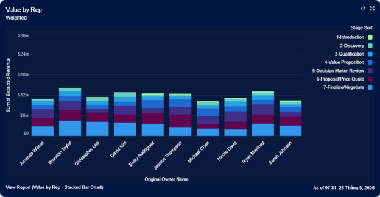

| Chart | Value |
|------|------|
| Value by Rep (Weighted) | Sum of Expected Revenue by Owner and Stage |

**Key Takeaway:**  
Highlights expected revenue contribution by sales representative, providing a more accurate view of likely revenue performance than raw pipeline value alone.

**Recommended Action:**
- Compare weighted contribution across sales reps.
- Identify reps with strong pipeline quality and forecast reliability.
- Use weighted performance metrics during forecasting and coaching discussions.

---

### ROW 6: Coverage Ratio by Rep

#### Coverage Ratio by Rep (Bar Chart)

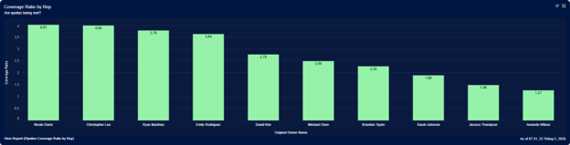

| KPI | Value |
|------|------|
| Coverage Ratio by Rep | Pipeline Value / Quota |

**Key Takeaway:**  
Shows each sales representative’s pipeline coverage relative to their assigned quota, where a value of **1.0 represents quota attainment**, values below 1.0 indicate underperformance, and values above 1.0 indicate that the rep is currently exceeding quota coverage expectations. This provides a clear, at-a-glance assessment of whether each rep is on track to meet quarterly revenue targets based on managed pipeline.

**Recommended Action:**
- Identify reps below 1.0 coverage and prioritize pipeline generation or deal acceleration.
- Monitor reps clustered around 1.0 to ensure stable quota attainment trajectory.
- Evaluate reps significantly above 1.0 for pipeline quality, deal realism, and potential forecast inflation.

---
